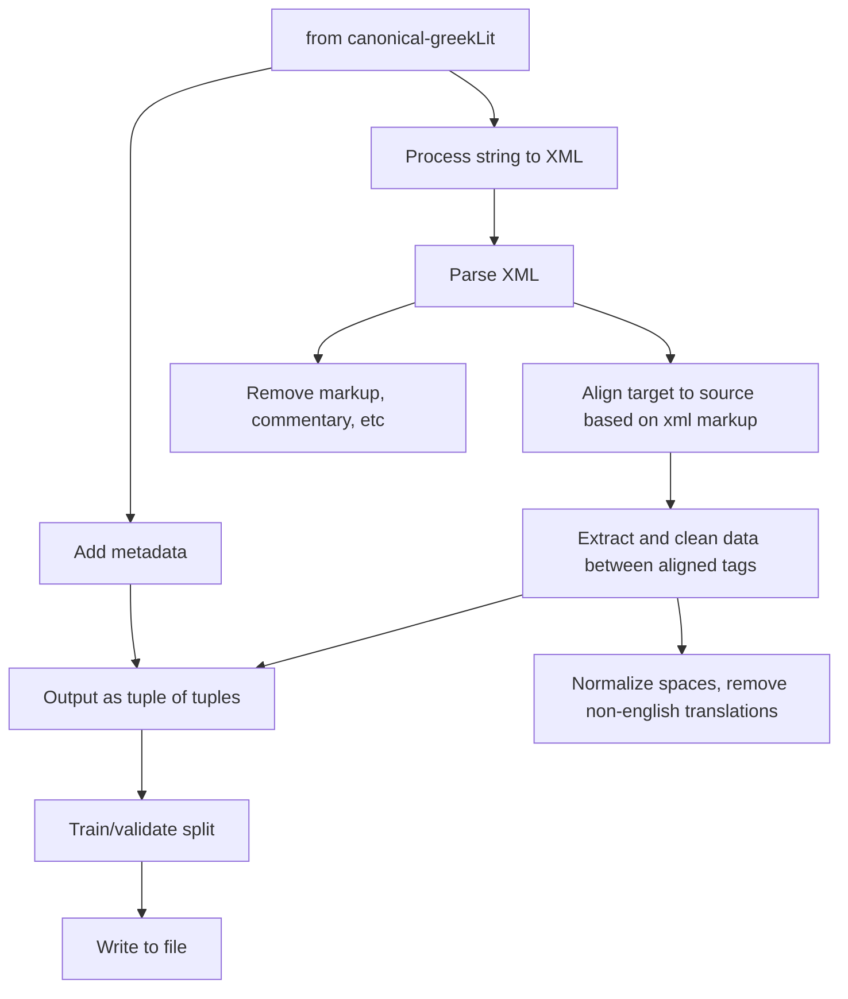

# DecodingDrama DataRepository

This repository contains data extracted from the repository https://github.com/PerseusDL/canonical-greekLit for the purpose of developing a translation model from greek to english, 

<!-- `DataStatistics.ipynb` and `DataStatistics.html` contain specific information about the quantity and type of data available.  -->

`metadata.tsv` contains information about which file in canonical-greekLit is a translation of which other file, and respective project ids (these are based on canonical-greekLit), it is based on the `__cts__.xml` files contained embedded in multiple locations of the data model.

The repository contains two partitioned data sets:
- **drama**   
- **nondrama**  
For these sets, one work per author, with all available translations, was manually selected for validation, and is contained in the respective `validation.tsv`

Further more, the much larger, dataset **prose** is also included. This dataset does not contain the data already contained in the other two sets. In this set, all translations for the shortest piece for each authors were selected for validation.

All files are released in tsv format including headers in the files `{drama,nondrama,prose}_train.tsv` and `{drama,nondrama,prose}_validate.tsv`, with an accompanying `{drama,nondrama,prose}_metadata.tsv`, specifying for each line:  
`urn:cts:greekLit:tlg0006.tlg001;Euripides;The·Cyclops;tlg0006.tlg001.perseus-eng2;0\t12.873170731707317\t37\t25`  
`{workid;author_name;title;translation_id;linenumber}\t{chunk_size}\t{english_words_in_line}\t{greek_words_in_line}`  

Each line may contain several sentences, as the source xmls have different granularity. To gauge the size of these across both languages, for each document, a measure of `chunk_size` was used, calulating for each chunk the mean of english and greek word counts, and calculating the mean of these means for each work. The smaller this number, the closer the alignment.

For each subset, these are the train / validate partitions

| (set, validate)     |   authorid |   avg chunk size |   summed english word count |   summed english line count |   summed greek word count |   summed greek line count | % of Total gr_ct   | % of Total gr_line_ct   |
|:--------------------|-----------:|-----------------:|----------------------------:|----------------------------:|--------------------------:|--------------------------:|:-------------------|:------------------------|
| ('drama', False)    |         34 |               18 |                      392328 |                       22385 |                    250877 |                     22385 | 3.76%              | 17.24%                  |
| ('drama', True)     |          4 |               55 |                       49590 |                        2034 |                     33098 |                      2034 | 0.5%               | 1.57%                   |
| ('nondrama', False) |          8 |               44 |                      381540 |                        4713 |                    255477 |                      4713 | 3.83%              | 3.63%                   |
| ('nondrama', True)  |          4 |               55 |                      261413 |                        3264 |                    180521 |                      3264 | 2.71%              | 2.51%                   |
| ('prose', False)    |        642 |              136 |                     6133775 |                       66176 |                   4234109 |                     66176 | 63.48%             | 50.97%                  |
| ('prose', True)     |         30 |              129 |                     2467239 |                       31259 |                   1715598 |                     31259 | 25.72%             | 24.08%                  |
| ('Total', '')       |        722 |              129 |                     9685885 |                      129831 |                   6669680 |                    129831 | 100.0%             | 100.0%                  |

For each author, this is the data availability  

|   (set, author, validate)                  |   avg chunk size |   summed english word count |   summed english line count |   summed greek word count |   summed greek line count |
|:-------------------------------------------|-----------------:|----------------------------:|----------------------------:|--------------------------:|--------------------------:|
| ('drama', 'Aeschylus', False)              |               13 |                       72933 |                        5019 |                     42566 |                      5019 |
| ('drama', 'Aeschylus', True)               |               16 |                        9497 |                         486 |                      5936 |                       486 |
| ('drama', 'Aristophanes', False)           |              138 |                       15400 |                          95 |                     10773 |                        95 |
| ('drama', 'Aristophanes', True)            |              174 |                       14321 |                          69 |                      9670 |                        69 |
| ('drama', 'Euripides', False)              |               15 |                      223024 |                       12924 |                    145015 |                     12924 |
| ('drama', 'Euripides', True)               |               15 |                       12072 |                         685 |                      8200 |                       685 |
| ('drama', 'Sophocles', False)              |               16 |                       80971 |                        4347 |                     52523 |                      4347 |
| ('drama', 'Sophocles', True)               |               15 |                       13700 |                         794 |                      9292 |                       794 |
| ('nondrama', 'Hesiod', False)              |               35 |                       18513 |                         454 |                     12756 |                       454 |
| ('nondrama', 'Hesiod', True)               |               35 |                        4659 |                         113 |                      3268 |                       113 |
| ('nondrama', 'Homer', False)               |               59 |                      332623 |                        3551 |                    224476 |                      3551 |
| ('nondrama', 'Homer', True)                |               76 |                      251923 |                        3025 |                    174354 |                      3025 |
| ('nondrama', 'Pindar', False)              |               35 |                       30404 |                         708 |                     18245 |                       708 |
| ('nondrama', 'Pindar', True)               |               31 |                        4831 |                         126 |                      2899 |                       126 |
| ('prose', 'Apollodorus', False)            |              136 |                       38688 |                         248 |                     28567 |                       248 |
| ('prose', 'Apollodorus', True)             |               54 |                       11486 |                         186 |                      8513 |                       186 |
| ('prose', 'Appianus of Alexandria', False) |              142 |                      312534 |                        1401 |                    222075 |                      1401 |
| ('prose', 'Appianus of Alexandria', True)  |               62 |                         495 |                           7 |                       362 |                         7 |
| ('prose', 'Aristotle', False)              |              593 |                      209659 |                         319 |                    122244 |                       319 |
| ('prose', 'Aristotle', True)               |              169 |                       10311 |                          49 |                      6258 |                        49 |
| ('prose', 'Athenaeus of Naucratis', True)  |              540 |                      847128 |                        1296 |                    551548 |                      1296 |
| ('prose', 'Barnabae Epistula', True)       |               37 |                        9162 |                         216 |                      6717 |                       216 |
| ('prose', 'Demosthenes', False)            |               77 |                      430976 |                        4699 |                    292318 |                      4699 |
| ('prose', 'Demosthenes', True)             |               85 |                        1595 |                          15 |                       950 |                        15 |
| ('prose', 'Diogenes Laertius', True)       |              103 |                      158218 |                        1305 |                    109573 |                      1305 |
| ('prose', 'Epictetus', False)              |              913 |                      221718 |                         204 |                    150682 |                       204 |
| ('prose', 'Epictetus', True)               |              115 |                       14762 |                         108 |                      9978 |                       108 |
| ('prose', 'Herodotus', True)               |               39 |                      240118 |                        5454 |                    184736 |                      5454 |
| ('prose', 'Homeric Hymns', False)          |               16 |                       23771 |                         818 |                     16278 |                       818 |
| ('prose', 'Homeric Hymns', True)           |               10 |                          57 |                           5 |                        35 |                         5 |
| ('prose', 'Isaeus', False)                 |               74 |                       47610 |                         547 |                     32259 |                       547 |
| ('prose', 'Isaeus', True)                  |               80 |                        1300 |                          14 |                       949 |                        14 |
| ('prose', 'Isocrates', False)              |               67 |                      178591 |                        2149 |                    118447 |                      2149 |
| ('prose', 'Isocrates', True)               |               50 |                         418 |                           7 |                       281 |                         7 |
| ('prose', 'Lucian of Samosata', False)     |              128 |                      910860 |                        6437 |                    711458 |                      6437 |
| ('prose', 'Lucian of Samosata', True)      |              195 |                        4598 |                          22 |                      3912 |                        22 |
| ('prose', 'Lysias', False)                 |               58 |                       82255 |                        1175 |                     55683 |                      1175 |
| ('prose', 'Lysias', True)                  |               35 |                         419 |                          10 |                       278 |                        10 |
| ('prose', 'New Testament', False)          |               18 |                      175091 |                        8129 |                    137554 |                      8129 |
| ('prose', 'New Testament', True)           |               18 |                         298 |                          15 |                       245 |                        15 |
| ('prose', 'Pausanias', True)               |               54 |                      272235 |                        4517 |                    217048 |                      4517 |
| ('prose', 'Plato', False)                  |               49 |                      776965 |                       13934 |                    558381 |                     13934 |
| ('prose', 'Plato', True)                   |               63 |                        2450 |                          32 |                      1545 |                        32 |
| ('prose', 'Plutarch', False)               |              225 |                     2249100 |                       18596 |                   1463930 |                     18596 |
| ('prose', 'Plutarch', True)                |              233 |                        2424 |                           8 |                      1308 |                         8 |
| ('prose', 'Pseudo-Plutarch', False)        |              312 |                       25103 |                          65 |                     15484 |                        65 |
| ('prose', 'Pseudo-Plutarch', True)         |              217 |                       11199 |                          44 |                      7917 |                        44 |
| ('prose', 'Thucydides', True)              |               41 |                      875571 |                       17911 |                    601444 |                     17911 |
| ('prose', 'Xenophon', False)               |               47 |                      450854 |                        7455 |                    308749 |                      7455 |
| ('prose', 'Xenophon', True)                |               66 |                        2995 |                          38 |                      2001 |                        38 |
| ('All', '', '')                            |              129 |                     9685885 |                      129831 |                   6669680 |                    129831 |

## Data processing

### Documentation of steps
* **process string to xml**  
* **parse xml**  
Remove front matter, and the content of the following tags `['speaker', 'stage', 'note', "head", np.nan, None, "label", "term", 'gloss', 'foreign', 'lg', 'bibl', 'del', 'reg', 'corr', "!--"]`, but retain the tail of the tags
* **align target to source**  
Taking into account xml attributes and tag names, allow variation regarding which tag gets aligned to which other tag
* **extract and clean data between aligned tags**  
Remove redundant white space and all line breaks whithin each chunk, normalize multiple spaces to a single space 
* **output as tuple of tuples**  
This data will be integrated with metadata from the original canonical-greekLit set
* **train/validate split**  
Described in detail above, one piece per author in validation data
* **add metadata**  
Described in detail above, include identifiers and some data attributes like chunk length and average chunk size 
* **write to tsv file**  